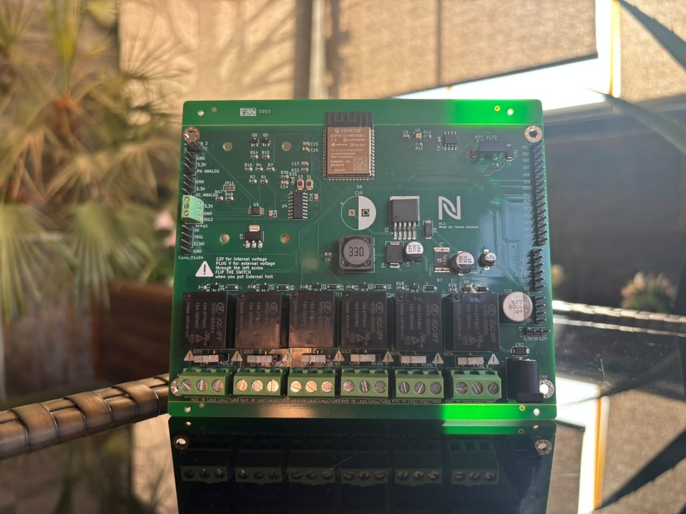
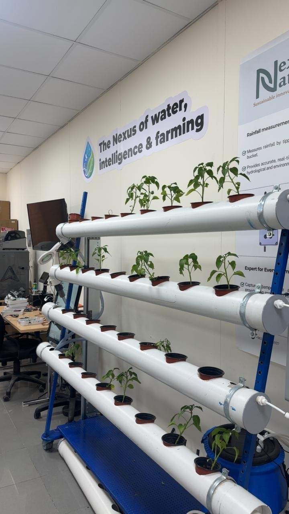
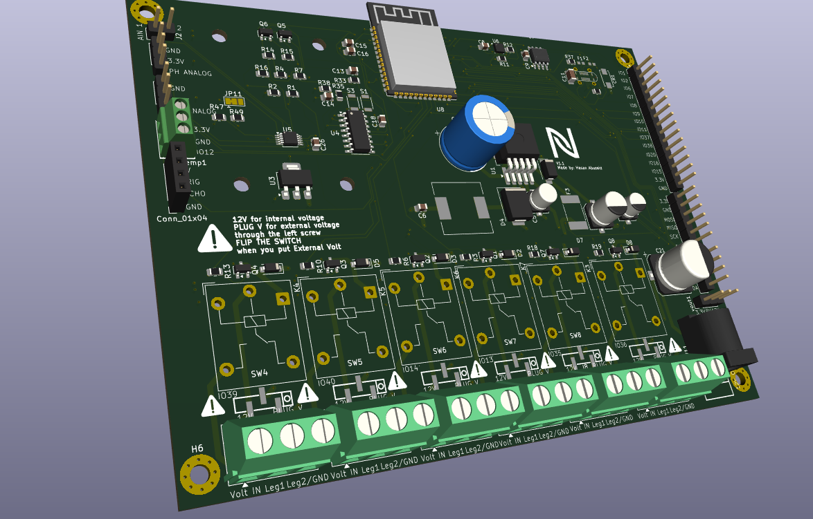
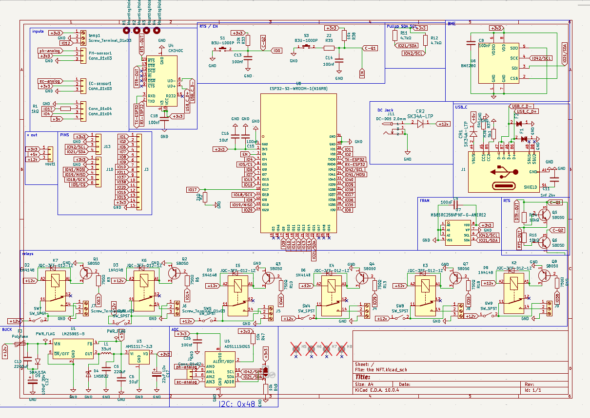
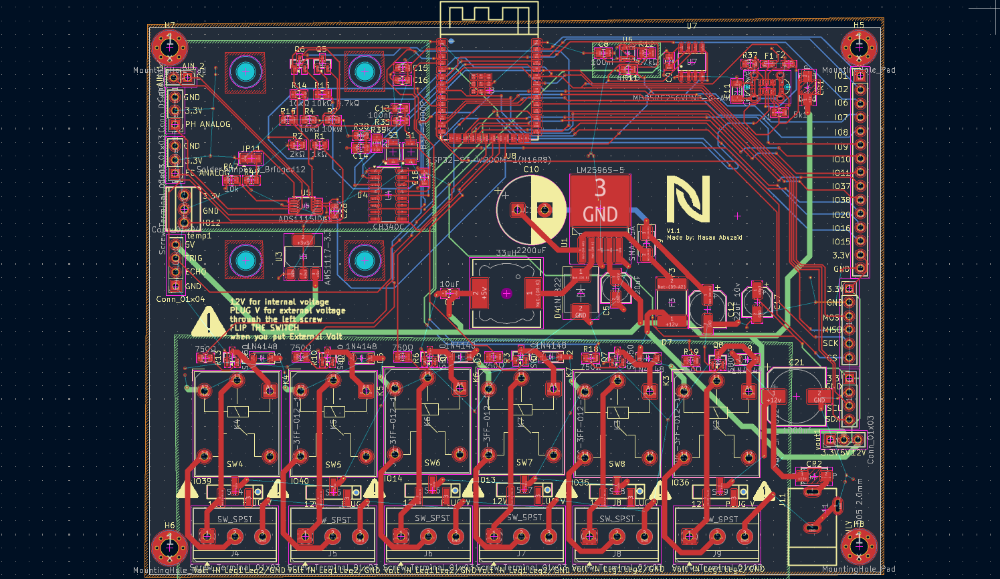

# NFT Hydroponic Controller — Open-Hardware PCB

**Status: v1.1 boards fabricated and assembled by JLCPCB. Bring-up and on-site testing in progress.**

A 4-layer, ESP32-S3 based controller board that turns a manual NFT (Nutrient Film Technique) hydroponic system into a self-regulating one. It reads pH, EC and water level from the main reservoir, switches up to six 12 V pumps (nutrient A, nutrient B, pH adjust, circulation, …) and integrates natively with **Home Assistant** through **ESPHome**.

The goal: replace the breadboards, loose jumper wires and relay modules that most DIY hydroponic builds end up with, with one board you can order pre-assembled from JLCPCB, screw your sensors and pumps into, and flash.



---

## Why this exists

NFT systems work by running a thin film of nutrient solution under the plant roots. The hard part is not the plumbing, it is keeping the solution chemistry right: pH drifts, EC drops as plants feed, and the tank level falls. Doing that by hand every day is what makes most home systems fail.

This board closes that loop:

```
 pH / EC / level sensors ──► ESP32-S3 ──► Home Assistant (automations decide dose)
          ▲                                      │
          └──── main tank ◄── dosing pumps ◄── relays ◄─┘
```

The ESP reports readings, Home Assistant decides how much A/B nutrient or pH-down to dose based on calibrated set-points, and the board drives the pumps.



---

## Features

| Block | Implementation |
|---|---|
| MCU | ESP32-S3-WROOM-1 (N16R8) — 16 MB flash, 8 MB PSRAM, Wi-Fi + BLE |
| USB | USB-C, CH340C USB-UART bridge with auto-reset/auto-boot (flash with no button presses), ESD protection on the data lines |
| Power input | 12 V DC barrel jack (DC-005, 2.0 mm) |
| Power conversion | LM2596S-5 buck (12 V → 5 V), AMS1117-3.3 LDO (5 V → 3.3 V) |
| Protection | SMAJ15A TVS on the 12 V rail, resettable polyfuse, Schottky OR-ing between USB and 12 V supply |
| Analog front-end | ADS1115 16-bit ADC for the pH and EC probe signals (far more stable than the ESP32's internal ADC) |
| Sensor inputs | pH and EC analog headers, water-temperature screw terminal, ultrasonic level header (5 V / TRIG / ECHO / GND), I²C header, GPIO breakout |
| Environment | On-board BME280 (air temperature, humidity, pressure) |
| Storage | MB85RC256V 32 KB I²C FRAM — stores calibration and state without flash wear |
| Outputs | 6× relay channels (JQC-3FF, SPDT) on 3-pin screw terminals (Volt IN / Leg 1 / Leg 2-GND), each with flyback diode and transistor driver |
| Load supply select | Per-channel switch: power the load from the board's internal 12 V, or from an external supply wired into that channel's Volt IN terminal |
| Buttons | BOOT and RESET |
| Power outputs | 3.3 V / 5 V / 12 V header for external modules |
| PCB | 4-layer, 1.6 mm, JLCPCB-ready (LCSC part numbers in the BOM) |


---

## Repository layout

```
.
├── nft-hydroponic-controller.kicad_pro   KiCad project (open this)
├── nft-hydroponic-controller.kicad_sch   Schematic
├── nft-hydroponic-controller.kicad_pcb   PCB layout
├── nft-hydroponic-controller.kicad_dru   Custom design rules
├── nft-hydroponic-controller.csv         Bill of materials with LCSC part numbers
├── nft-hydroponic-controller.xml         Netlist
├── DRC.rpt, ERC.rpt                      Design rule / electrical rule check reports
├── libs/lcsc/                Symbols, footprints and 3D models imported from LCSC
├── Custom_JLCPCB_Parts/      Custom parts library
├── compunents/               Additional vendor symbols/footprints
├── fp-lib-table, sym-lib-table   Project-relative library tables
├── firmware/esphome/         ESPHome config + secrets template
└── docs/images/              Photos and renders
```

All library paths are project-relative, so the project opens without missing symbols or footprints on a fresh machine.





---

## Requirements

- **KiCad 10** or newer (the files are saved in KiCad 10 format and will not open in older versions)
- Optional: the **Fabrication Toolkit** plugin (KiCad Plugin & Content Manager) to export JLCPCB-ready Gerbers, BOM and pick-and-place in one click — settings are included in `fabrication-toolkit-options.json`

---

## Ordering the board

1. Open `nft-hydroponic-controller.kicad_pro` in KiCad.
2. Open the PCB editor and run **Fabrication Toolkit** (or export Gerbers, drill files, BOM and CPL manually).
3. Upload the generated ZIP to JLCPCB. Select **4 layers**, 1.6 mm.
4. Enable **PCB Assembly** and upload the BOM and CPL. The LCSC part numbers are already assigned.
5. Through-hole parts (relays, screw terminals, barrel jack, large electrolytic) can be assembled by JLCPCB or hand-soldered.

Ready-made manufacturing files are also attached to each [Release](../../releases).

### Using the relay channels

Each channel's terminal block is **Volt IN / Leg 1 / Leg 2-GND**.

- **Internal 12 V (default):** leave the channel's switch in the internal position. The pump connects between Leg 1 and Leg 2-GND and runs from the board's 12 V input.
- **External voltage:** wire your supply into that channel's **Volt IN** terminal and flip the channel's switch to external. Use this for pumps or loads that need something other than 12 V.

---

## Pin mapping

| Function | ESP32-S3 GPIO |
|---|---|
| Relay 1 | `GPIO39` |
| Relay 2 | `GPIO40` |
| Relay 3 | `GPIO14` |
| Relay 4 | `GPIO13` |
| Relay 5 | `GPIO35` |
| Relay 6 | `GPIO36` |
| I²C SDA (ADS1115, BME280, FRAM) | `GPIO21` |
| I²C SCL | `GPIO42` |
| Water temperature | `GPIO12` |
| Ultrasonic level (trig / echo) | `GPIO4` / `GPIO17` (echo through a 1k/2k divider, 5 V-safe) |

ADS1115 (I²C address `0x48`): pH → `AIN0`, EC → `AIN3`.

---

## Firmware

The board runs **ESPHome** and reports to Home Assistant over **MQTT** (with MQTT discovery, so entities appear automatically). The config is in [`firmware/esphome/nutrient-controller.yaml`](firmware/esphome/nutrient-controller.yaml).

> This is the configuration used during development. Check the pin assignments against the [pin mapping](#pin-mapping) above before flashing it to the v1.1 board.

Setup:

1. Copy `firmware/esphome/secrets.yaml.example` to `secrets.yaml` and fill in your Wi-Fi, MQTT broker and passwords.
2. Plug the board into your computer via USB-C (no need to press BOOT, auto-reset is on board).
3. In Home Assistant → ESPHome Builder, create a device, paste the config, and choose **Install → Plug into this computer**.
4. After the first flash, updates happen over Wi-Fi.

---

## Calibration

pH and EC probes drift and vary between units, so set-points must be calibrated per probe:

- **pH:** two-point calibration with pH 4.0 and pH 7.0 buffer solutions.
- **EC:** calibrate with a known reference solution (e.g. 1413 µS/cm).
- **Dosing:** dose a small, measured volume, wait for the tank to mix, and record the change in pH/EC. This gives the "dose per unit change" used by the automations.

---

## Safety

- The relays are rated for mains voltage, but **this board is designed for 12 V DC loads only**. Do not switch mains through it unless you understand creepage/clearance requirements and have an enclosure rated for it.
- Water and electronics: mount the board above the reservoir, in an enclosure, with drip loops on every cable.
- Keep the pH-down acid and nutrient concentrates away from the electronics.

---

## Project status

| | |
|---|---|
| Revision | v1.1 |
| Boards | Fabricated and assembled (JLCPCB) |
| Tested | Not yet — bring-up results will be posted here |
| Known issues | Relays 5 and 6 use GPIO35/36. On the N16R8 module these pins are wired to the octal PSRAM. Leave PSRAM disabled in firmware and verify both channels during bring-up; fix planned for the next revision. |

---

## Contributing

Issues and pull requests are welcome, especially: tested pin mappings for other sensor probes, enclosure designs, and Home Assistant automation improvements. If you build one, open an issue with a photo.

---

## Credits

Designed by **Hasan Abuzaid** — Mechatronics Engineering, German Jordanian University.
Developed during an IoT/embedded internship at **Nexus Nature**.

## License

Hardware: [CERN-OHL-S-2.0](LICENSE). Firmware and configuration files: MIT.
